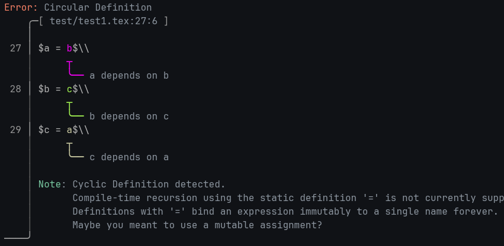
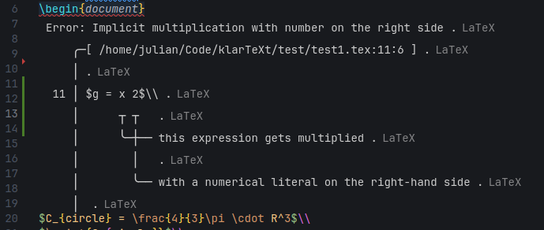

<h1 align="center">THE KLARTEXT PROGRAMMING LANGUAGE</h1>

    

Often, LaTeX is used to write reports about computations. If all relevant details to describe the computation are in the report, as they should be, it should also be possible to use the report itself as source code.

> All relevant information should be contained in the LaTeX document already, plain to see, in **Klartext**.

Describing computations in LaTeX and executing them on a calculator or in a separate python script, copying and pasting results back and forth, is redundant and error-prone.

This repository contains the klarTeXt interpreter for LaTeX documents, written in Rust by Julian Karrer under the MIT license. Feel free to contribute, fork, share, raise issues or [contact me](mailto:jk@studioerika.de).

# Usage

- Clone or download this repository and compile using `cargo build --release`
- make sure `klarTeXt` is in your `PATH`
- `\input{package}` at the top of your Latex file using `src/package.tex`
- Now you can use the `\begin{program} ... \end{program}` environment and fill it with mathematical statements like `$x = 5$\\ $\print{3x}$`

# Features
- [x] Common operations like `+`,`-`, multiplication (`\cdot`), division (`\frac{...}{...}`), exponentiation (`^`), n-th roots etc.
- [x] Predefined constants like `e`, π (`\pi`), etc.
- [x] Global, constant defintions like `C = \frac{4}{3}\pi R^3`, `R=2` where the order of the definitions does not matter
  - klarTeXt creates a dependency graph of constant definitions and resolves it topologically, detecting errors like loops or missing definitions.
- [x] Print statements that integrate into Latex, e.g. rendering `$\print{5x}$` as `5x = 4.57`
- [x] Useful, precise and [beautiful](https://docs.rs/ariadne/latest/ariadne/)  error messages
  
  as a command-line application:
  
  

  or directly in your favourite LaTeX IDE:
    
  \

And more to come:
- [ ] Predefined functions like `exp`, `log_{...}`, `ln`, `sin`, `cos`, `tan` (and respective inverses like `sin^{-1}` or `\arcsin`) `min`, `max`, `\Theta`, `\Gamma`
- [ ] User-defined functions `f(x,y,...) = ...`
- [ ] Complex numbers and the constant literal `i`
- [ ] More printing options (exact fractions? big integers? scientific notation?)
- [ ] Vectors, matrices, tensors (arrays? tuples?)
- [ ] Control flow, mutable assignments and iteration (guarantee termination, total language?)
- [ ] Sums, products and other iterators
- [ ] Drawing from random distributions
- [ ] Pointwise function application on large vectors via GPGPU (graphics and simulation!)
- [ ] More IO options (plots, csv input, file output)
- [ ] Boolean Logic
- [ ] Sets?

# The Language
- a `\begin{program} ... \end{program}` environment may contain mathematical statements delimited by `$...$`
- `\\`, `%`-comments and whitespace (` `, `\n` `\t`, etc.) is ignored
- integers and real numbers with decimal points are numeric literals (e.g. `42`, `0.161`, ...)
- supports:
  - **EXPRESSIONS** with
    - Addition `1 + 1`
    - Subtraction `5 - 2`
    - Negation `-1`
    - Multiplication `5 \cdot 3`
    - Implicit multiplication `5x`, `3(x + 4)`
      - numeric literals should not be on the right-hand side
    - Factorials `5!`
    - Exponentiation `10^{-6}`
    - Fractions / Division `\frac{2}{3}`
    - Bracketed subexpressions (`(5+3)`, `\left(6-2\right)`, quiet: `{3+2}`)
    - N-th roots (`\\sqrt{\pi}`, `\\sqrt[3]{6}`, `\\sqrt[2\pi]{3e}`)
      - where the degree can be any expression that doesn't evaluate to zero!
    - Identifiers that are user-defined, see below, or predefined constants like e, π, ...
  - Constant **DEFINITIONS** `C = \frac{4}{3}\pi R^3`, `R = 5`
    - the order they are written in does not matter
    - these are currently evaluated after parsing to a 64-bit floating point number
    - the **IDENTIFIERS** on the left-hand side may be:
      - any single letter or latex symbol that is not a keyword (`\phi`, `\kappa`, ...) 
      - with optional subscript that may contain anything, including nested subscripts (`E_{ges, pot_{3}}` is a valid identifier)
  - **PRINT STATEMENTS** filled with an arbitrary expression `\print{5!}`, `\print{x}`, `\print{4\cdot m^2}`
    - these produce output files that are imported directly by the LaTeX package, so `\print{2x}` in your LaTeX code might result in `2x = 42` in your document!

## Mission

Many programming languages claim to be easy to learn since they are 'close to mathematical notation', but overlook that there already exists a concrete syntax for the language of mathematics on computers used by millions of students and researchers worldwide in the form of LaTeX. Just use the concrete syntax people are already using instead of teaching a new one for your language.

KlarTeXt aims to require little to no explanation for people that use LaTeX to typeset equations and algorithms, but simply accept conventional notation and interpret it. 

It aims to provide the tools to make reports that *are* the source code they describe, in the spirit of the [literate programming](https://en.wikipedia.org/wiki/Literate_programming) paradigm that the creator of TeX himself envisioned, similar in appeal to what computational notebooks like Jupyter provide.

It turns your favourite LaTeX compiler into a glorified calculator by attaching a parser and interpreter.

