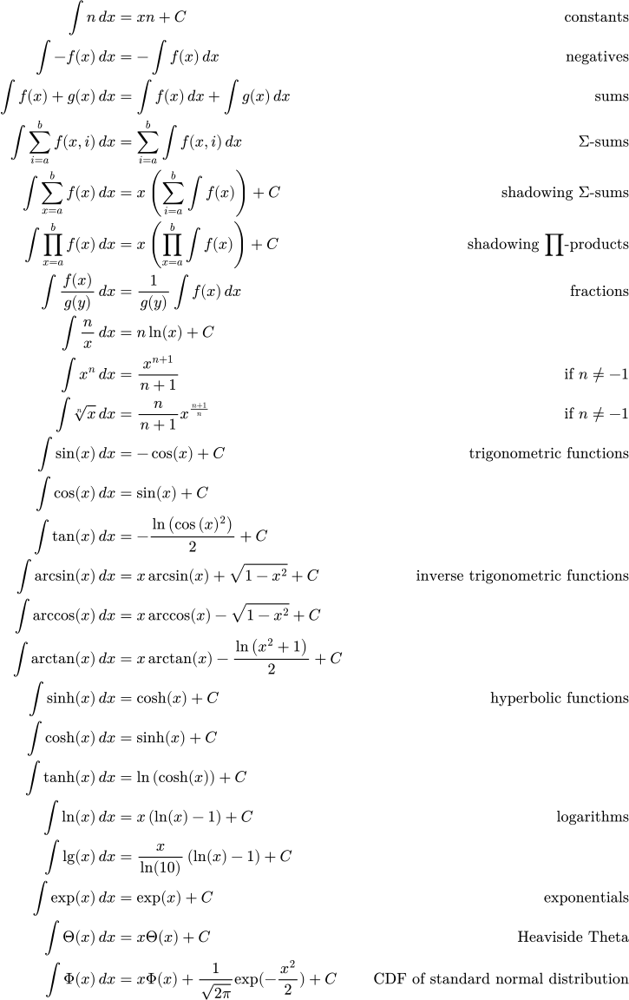

<h1 align="center">THE KLARTEXT INTERPRETER</h1>

    

KlarTeXt is a language embedded in LaTeX that turns your equations into instructions by interpreting them during document compilation. It allows you to perform common arithmetic operations, symbolic differentiation, integration, simplification and more, right there and in-line in your LaTeX document, with helpful error messages where you need them. It basically turns your Latex compiler into a glorified calculator by attaching a parser and interpreter with a small computer algebra system.

Often, LaTeX is used to write reports about computations. If all relevant details to describe the computation are in the report, it should also be possible to use the report itself as source code and not require a separate script to calculate results.

> All relevant information should be contained in the LaTeX document already, plain to see, in **Klartext**.

This repository contains the klarTeXt interpreter for LaTeX documents, written in Rust by Julian Karrer under the MIT license. Feel free to contribute, fork, share, raise issues or [contact me](mailto:jk@studioerika.de).

# Features
- [x] Common operations like `+`,`-`, multiplication (`\cdot`), division (`\frac{...}{...}`), exponentiation (`^`), n-th roots etc.
- [x] Predefined constants like `e`, π (`\pi`), etc.
- [x] Predefined functions like `exp`, `log_{...}`, `ln`, `sin`, `cos`, `tan` (and respective inverses like `\arcsin`) `min`, `max`, `\Theta`, ...
- [x] User-defined functions like `f(x,y) = 2x+y^2` or `\text{comp}(f,g,x) = f(g(x))`
  - Functions are first-class, you can print and combine them
- [x] Sums and products like `\sum_{i=0}^5 i` or `\prod_{j=5}^{10} \pi j^2`
- [x] Custom constant defintions like `C = \frac{4}{3}\pi R^3`, `R=2` where the order of the definitions does not matter
  - klarTeXt creates a dependency graph of constant definitions and resolves it topologically, detecting errors like loops or missing definitions.
- [x] Definite integrals like `\int_0^\pi \sin(x)\,dx` using symbolic integration with numeric Gauss-Kronrod G7K15 quadrature as a fallback
- [x] Print statements that integrate into Latex, e.g. rendering `$\print{5x}$` as `5x = 4.57`
- [x] Useful, precise and [beautiful](https://docs.rs/ariadne/latest/ariadne/)  error messages and warnings

  directly in your favourite LaTeX IDE:
    
  
  
  or when used as a command-line application:
  
  

Potential Roadmap:
- [ ] Complex numbers and the constant literal `i`
- [ ] More printing options (exact fractions? big integers? scientific notation?)
- [ ] Vectors, matrices, tensors (arrays? tuples?)
- [ ] Control flow, mutable assignments and iteration (guarantee termination, total language?)
- [ ] Drawing from random distributions
- [ ] Pointwise function application on large vectors via GPGPU (graphics and simulation!)
- [ ] More IO options (plots, csv input, file output)
- [ ] Boolean Logic
- [ ] Sets?

# Installation

- Clone or download this repository and compile using `cargo build --release`
- make sure `klarTeXt` is in your `PATH`
- `\input{package}` at the top of your Latex file using `src/package.tex`
- Now you can use the `\begin{program} ... \end{program}` environment and fill it with mathematical statements like `$x = 5$\\ $\print{3x}$`

# The Language
- a `\begin{program} ... \end{program}` environment may contain mathematical statements delimited by `$...$`
- `\\`, `%`-comments and whitespace (` `, `\n` `\t`, etc.) is ignored
- integers and real numbers with decimal points are numeric literals (e.g. `42`, `0.161`, ...)
- supports:
  - **EXPRESSIONS** with
    - Addition `1 + 1`
    - Subtraction `5 - 2`
    - Negation `-1`
    - Multiplication `5 \cdot 3`
    - Implicit multiplication `5x`, `3(x + 4)`
      - numeric literals should not be on the right-hand side
    - Factorials `5!`
    - Exponentiation `10^{-6}`
    - Fractions / Division `\frac{2}{3}`
    - Bracketed subexpressions (`(5+3)`, `\left(6-2\right)`, quiet: `{3+2}`)
    - N-th roots (`\\sqrt{\pi}`, `\\sqrt[3]{6}`, `\\sqrt[2\pi]{3e}`)
      - where the degree can be any expression that doesn't evaluate to zero!
    - Identifiers that are user-defined, see below, or predefined constants like e, π, ...
    - Calls to functions like `f()`, `f \left(\frac{1}{2}, 3 \right)` etc., for example to predefined functions:
      - trigonometric `\sin, \cos, \tan, \arcsin, \arccos, \arctan, \sinh, \cosh, \tanh`
      - exponential and logarithmic `\exp, \ln, \log, \lg`
      - minimum and maximum (with any number of arguments!) `\min, \max`
      - others like the Heaviside theta `\Theta`
    - sums and products (`\sum_{i=0}^5 i`, `\prod_{j=5}^{10} \pi j^2`)
    - definite integrals like `\int_0^\pi \sin(x)\,dx`
  - Constant **DEFINITIONS** `C = \frac{4}{3}\pi R^3`, `R = 5`
    - the order they are written in does not matter
    - these are currently evaluated after parsing to a 64-bit floating point number
    - the **IDENTIFIERS** on the left-hand side may be:
      - any single letter or latex symbol that is not a keyword (`\phi`, `\kappa`, ...) 
      - with optional subscript that may contain anything, including nested subscripts (`E_{ges, pot_{3}}` is a valid identifier)
  - **PRINT STATEMENTS** filled with an arbitrary expression `\print{5!}`, `\print{x}`, `\print{4\cdot m^2}`
    - these produce output files that are imported directly by the LaTeX package, so `\print{2x}` in your LaTeX code might result in `2x = 42` in your document!
  - **SIMPLIFY STATEMENTS** filled with an arbitrary expression `\simplify{\int_{2}^{5} \cos(x) + sin(x) \,dx}`, `\simplify{\ddx{y} cos(2y)}` etc.
    - these function similar to print statements but yield a simplified, symbolic expression instead of a number, e.g. `2\pi` instead of `6.28318...`

# Implemented Rules

## Symbolic Integration
Integrals are first attempted to be symbolically integrated - if symbolic integration fails, definite integrals are numerically evaluated using Gauss-Kronrod G7K15 quadrature. 
The following set of rules is used repeatedly and recursively:

<picture width="min(600px, 80%)">
  <source media="(prefers-color-scheme: dark)" srcset="./res/integration-inverted.svg">
  
</picture>

where n is constant with respect to x. If n cannot statically be proven to be different from -1, since for example it occurs open in a term of a function body, some rules cannot be applied.

## Simplification
The following rules for simplification of terms, including open terms with free variables, are implemented. Where the symmetric case of a rule applies due to commutativity, this should also be implemented.

<picture width="min(600px, 80%)">
  <source media="(prefers-color-scheme: dark)" srcset="./res/simplification-inverted.svg">
  
</picture>

The above rules for analytically solvable integrals and constant folding (if subexpressions are values, evaluate the entire expression, e.g. `5 + 7' becomes `12' while `5x' remains `5x') are also implemented.

<!-- ## Mission

There already exists a concrete syntax for the language of mathematics on computers used by millions worldwide in the form of LaTeX, so it lends itself to the syntax of a CAS.

KlarTeXt aims to require little to no explanation for people that use LaTeX to typeset equations and algorithms, but simply accept conventional notation and interpret it. 

It aims to provide the tools to make reports that *are* the source code they describe, in the spirit of the [literate programming](https://en.wikipedia.org/wiki/Literate_programming) paradigm that the creator of TeX himself envisioned, similar in appeal to what computational notebooks like Jupyter provide. -->

